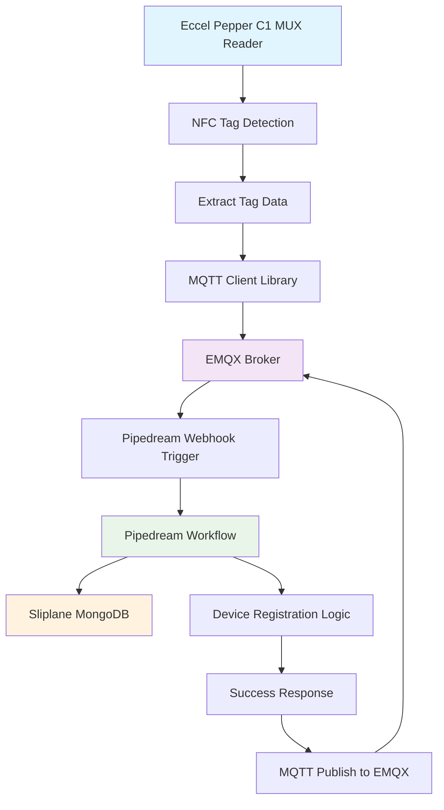

# 100 - Device Registration Workflow

Architecture Overview



1. **Go to Pipedream Dashboard**
  - Visit [https://pipedream.com](https://pipedream.com)
  - Sign in to your account (here: using email ```wvanheemstra@icloud.com```)
  - Go to project "[Agility Game]()"
  - Click "New Workflow"
  - Name it "Device Registration"

  

2. **Setup HTTP Webhook Trigger**
  - Select "HTTP / Webhook" as trigger
  - Choose "New HTTP Requests"
  - Copy the webhook URL (e.g., `https://eoh8781e35at724.m.pipedream.net`)


Optionally, send a Test event:


Success!!


3. **Add Name Generation Logic**
  - Add "Node.js" step for custom code:​​​​​​​​​​​​​​​​


```
// Generate Two-Word Name
import { MongoClient } from 'mongodb';

export default defineComponent({
 async run({ steps, $ }) {
   
   // MongoDB connection details
   const uri = process.env.MONGODB_URI; // Set in Pipedream environment variables
   const client = new MongoClient(uri);

   try {
     await client.connect();
     const db = client.db('mqtt_registry');

     // Get word lists
     const wordLists = await db.collection('word_lists').findOne({_id: 'naming_words'});
     const adjectives = wordLists.adjectives;
     const nouns = wordLists.nouns;

     // Generate unique name
     let generatedName;
     let nameExists = true;
     let attempts = 0;

     while (nameExists && attempts < 50) {
       const adj = adjectives[Math.floor(Math.random() * adjectives.length)];
       const noun = nouns[Math.floor(Math.random() * nouns.length)];
       generatedName = `${adj}-${noun}`;

       // Check if name exists
       const existing = await db.collection('device_registry').findOne({_id: generatedName});
       nameExists = existing !== null;
       attempts++;
     }

     if (nameExists) {
       throw new Error('Could not generate unique name after 50 attempts');
     }

     // Extract device data from webhook payload
     const deviceData = steps.trigger.event.body;

     // Prepare device document
     const deviceDoc = {
       _id: generatedName,
       client_id: generatedName,
       original_client_id: deviceData.client_id || steps.trigger.event.headers['x-client-id'],
       device_type: deviceData.device_type,
       mac_address: deviceData.mac_address,
       location: deviceData.location,
       ip_address: deviceData.ip_address,
       firmware_version: deviceData.firmware_version,
       status: "online",
       registered_at: new Date().toISOString(),
       last_seen: new Date().toISOString(),
       metadata: deviceData.metadata || {}
     };

     // Insert device into registry
     await db.collection('device_registry').insertOne(deviceDoc);

     return {
       success: true,
       assigned_name: generatedName,
       device_data: deviceDoc,
       message: "Device registered successfully"
     };

   } catch (error) {
     return {
       success: false,
       error: error.message
     };
   } finally {
     await client.close();
   }
 }
});
```

Name the step "generate_name".


Test our step:


Success! A new device is registered in the MongoDB database "**mqtt_registery**" inside the collection "**device_registry**" and a two-word combination is assigned to it (here: ```rapid-flame```).

This can also be seen from our MongoDB Client:


4. **Add Response to EMQX Broker Logic**
  - Add "Node.js" step for custom code:​​​​​​​​​​​​​​​​


**WARNING**: You will have to configure the workflow to allow for **returning a custom response**.


```
// HTTP Response (Send response back to EMQX)
export default defineComponent({
 async run({ steps, $ }) {
   const result = steps.generate_name.$return_value;

   await $.respond({
     status: result.success ? 200 : 400,
     headers: {
       "Content-Type": "application/json"
     },
     body: {
       success: result.success,
       assigned_name: result.assigned_name,
       message: result.message,
       timestamp: new Date().toISOString()
     }
   });
 }
});
```

5. **Add MQQT Response to EMQX Broker Logic**
  - Add "Node.js" step for custom code:​​​​​​​​​​​​​​​​

  

```
// Send MQTT Response (if you have MQTT client capability)
export default defineComponent({
 async run({ steps, $ }) {
   const result = steps.generate_name.$return_value;
   const originalClientId = result.device_data.original_client_id;

   // This would require MQTT client library in Pipedream
   // For now, we'll use HTTP to EMQX REST API to publish response

   const emqxApiUrl = process.env.EMQX_API_URL; // e.g., https://your-emqx.com/api/v5
   const emqxApiKey = process.env.EMQX_API_KEY;

   const publishPayload = {
     topic: `device/register/response/${originalClientId}`,
     payload: JSON.stringify({
       success: result.success,
       assigned_name: result.assigned_name,
       message: result.message,
       timestamp: new Date().toISOString()
     }),
     qos: 1,
     retain: false
   };

   try {
     const response = await fetch(`${emqxApiUrl}/publish`, {
       method: 'POST',
       headers: {
         'Authorization': `Bearer ${emqxApiKey}`,
         'Content-Type': 'application/json'
       },
       body: JSON.stringify(publishPayload)
     });

     return {
       mqtt_published: response.ok,
       response_topic: publishPayload.topic
     };
   } catch (error) {
     return {
       mqtt_published: false,
       error: error.message
     };
   }
 }
});
```

6. **Deploy the workflow**


And test the deployed workflow (https://eoh8781e35at724.m.pipedream.net):


We sent a sample device configuration:

```
{
    "device_type": "Eccel Pepper C1 MUX",
    "mac_address": "AA:BB:CC:DD:EE:FF",
    "location": "office",
    "ip_address": "192.168.1.100",
    "firmware_version": "1.2.3"
}
```

And the workflow shows successful!


Also when looked at from the MongoDB Client:


== WE ARE HERE ==
