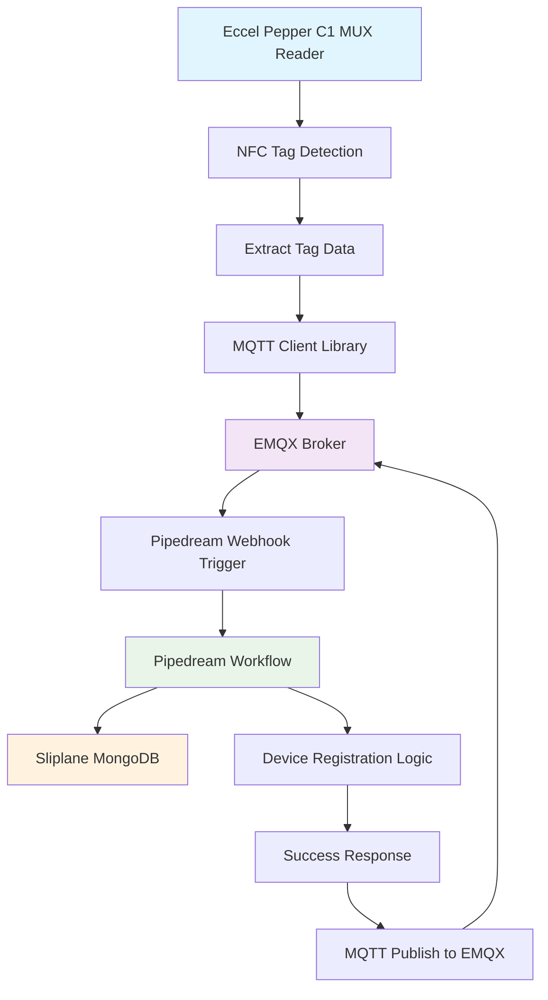

# 100 - Registering a Device

Overview

```mermaid
graph TD
    A[Eccel Pepper C1 MUX Reader] --> B[NFC Tag Detection]
    B --> C[Extract Tag Data]
    C --> D[MQTT Client Library]
    D --> E[EMQX Broker]
    E --> F[Pipedream Webhook Trigger]
    F --> G[Pipedream Workflow]
    G --> H[Sliplane MongoDB]
    G --> I[Device Registration Logic]
    I --> J[Success Response]
    J --> K[MQTT Publish to EMQX]
    K --> E

    style A fill:#e1f5fe
    style E fill:#f3e5f5
    style G fill:#e8f5e8
    style H fill:#fff3e0
```

MORE
