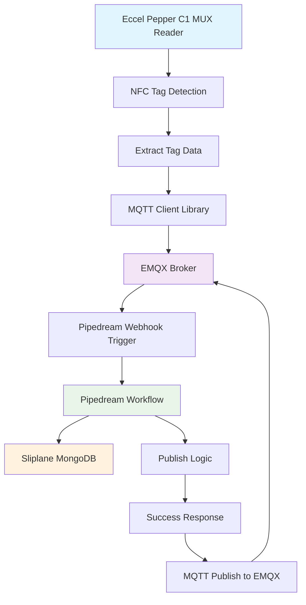

# 600 - Managing Publish

Overview



We'll be using EMQX Broker's Rule Engine.

The Rule Engine in EMQX MQTT Broker is a software component that allows users to define and execute rules based on MQTT messages. It can be used to extract, filter, enrich, and transform MQTT messages, as well as trigger actions based on specific criteria. This helps to reduce manual intervention and accelerate data integration and application development.

See also [Getting Started with Rule Engine in MQTT Broker: A Quick Guide | EMQ](https://frshl.ink/EFMt).

**Note**: The Rule Engine is supported in EMQX Cloud. It has been officially renamed to '**Data Integration**'.


Lookup the URL of the Webhook on Pipedream to be used for "Publish v1":

See https://pipedream.com/@wvanheemstra/projects/proj_e5smjgK/publish-v1-p_aNCx3Va/inspect


The URL of the Webhook is: https://eowu9nfjfw5x4qr.m.pipedream.net

Now choose **Web Service** -> **HTTP** on EMQX's Data Integration page, which allows you to enter the previously found URL of the Webhook in Pipedream.


**Note**: Make sure to have ```Enable TLS``` **enabled**, and ```TLS Verify``` **disabled**.

Click **Test** to check if the triggering of the webhook is working successfully.


We see a dialogue in the upper right corner **Connector Available**, hence the test is successful.

Click **New** to save the newly created connector (here: ```c-q3297d6a-db112d```).

You will see the new connector listed (here: **Publish v1**).


Now it is time to add a Rule, by clicking on **+ New Rule**.


Use the following for SQL:

```sql
SELECT 
  clientid,
  payload.device_type as device_type,
  payload.mac_address as mac_address,
  payload.location as location,
  payload.ip_address as ip_address,
  payload.firmware_version as firmware_version,
  payload.action as action,
  now_timestamp('millisecond') as timestamp
FROM 
  "publish/v1"
WHERE 
  payload.action = 'publish/v1'
```

Then above SQL statement does the following:

- It references the ```publish/v1``` MQTT topic defined on EMQX Broker used for picking up publications (e.g. Eccel C1 PEPPER MUX Reader).
- It provides the data (here: ```payload```), as well as the client id that was sent in the MQTT message to the above topic and creates a timestamp.
- It won't progress if the ```action``` is other than ```publish/v1```.

In **Note**, write ```Publish v1``` for ease of reference.

Now for the purpose of testing our SQL, enable **Try It Out**.


You should see that the topic is now set to ```publish/v1```.

Scroll down and fill in the fields as follows:

- Data Source: **Message Publish**


- Client ID: **undefined** (as we still have to register the device, which will set a Client ID)
- Username: **tlkaaxtf:tlkaaxtf** (as defined in EMQX Broker under authentication)
- Topic: **publish/v1**
- Quality of Service (QoS): **1** (meaning we expect confirmation by Pipedream on retrieval of the message)
- Payload:

   ```json
   {
     "device_type": "Eccel Pepper C1 MUX",
     "mac_address": "AA:BB:CC:DD:EE:FF",
     "location": "office",
     "ip_address": "192.168.1.100",
     "firmware_version": "1.2.3",
     "action": "publish/v1"
   }
   ```

For testing purposes we set arbitrary values as payload. In practice, this data will come from Eccel Pepper C1 MUX Reader.


Click **Test**.


We see **Test Passed** and the following Output Result:

```json
{
  "action": "publish/v1",
  "clientid": "undefined",
  "device_type": "Eccel Pepper C1 MUX",
  "firmware_version": "1.2.3",
  "ip_address": "192.168.1.100",
  "location": "office",
  "mac_address": "AA:BB:CC:DD:EE:FF",
  "timestamp": 1751023123303
}
```

Congratulations!

Click **Next**.

Next, we will be prompted which Connector we want to be using with our newly created Rule.


We select the previously created Connector (here ```c-q3297d6a-f168f6```, that connects with PipeDreams's Webhook for "Publish v1").

Fill in the fields as follows:

- Action Type: **HTTP Server** (as we are using a Webhook call)
- Action Name: **a-q3297d6a-f12dda** (which is auto-generated and unique)
- Note: **Publish v1**
- URL: ```Leave this empty, we are not specifying a deeper path for PipeDream's WebHook for "Publish v1"```
- Method: **POST** (as we expect a response from the PipeDream's Webhook for "Publish v1")

Leave all Headers at their default values.


In addition, scroll down and fill in the following:

- Body: 

  ```json
  {
    "client_id": "${clientid}",
    "device_type": "${device_type}",
    "mac_address": "${mac_address}",
    "location": "${location}",
    "ip_address": "${ip_address}",
    "firmware_version": "${firmware_version}",
    "action": "{action}",
    "timestamp": "${timestamp}"
  }
  ```

- Advanced Settings: ```Leave all default values as they are.```

MORE