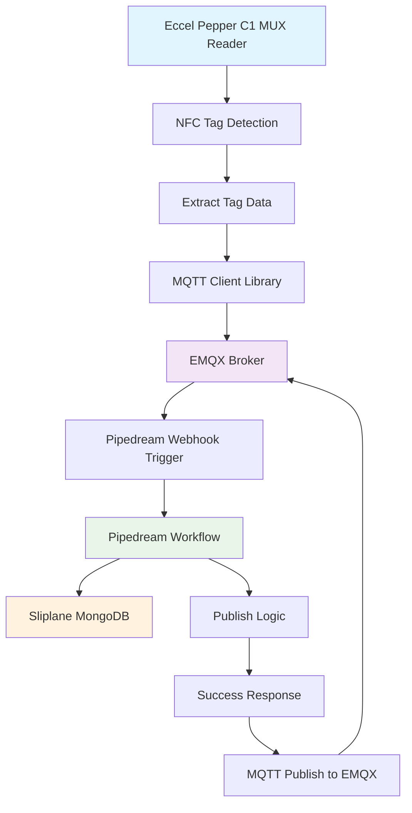

# 600 - Managing Publish

Overview

We'll be using EMQX Broker's Rule Engine.

The Rule Engine in EMQX MQTT Broker is a software component that allows users to define and execute rules based on MQTT messages. It can be used to extract, filter, enrich, and transform MQTT messages, as well as trigger actions based on specific criteria. This helps to reduce manual intervention and accelerate data integration and application development.

See also [Getting Started with Rule Engine in MQTT Broker: A Quick Guide | EMQ](https://frshl.ink/EFMt).

**Note**: The Rule Engine is supported in EMQX Cloud. It has been officially renamed to '**Data Integration**'.

Lookup the URL of the Webhook on Pipedream to be used for "Publish v1":

See https://pipedream.com/@wvanheemstra/projects/proj_e5smjgK/publish-v1-p_aNCx3Va/inspect

The URL of the Webhook is: https://eowu9nfjfw5x4qr.m.pipedream.net

MORE